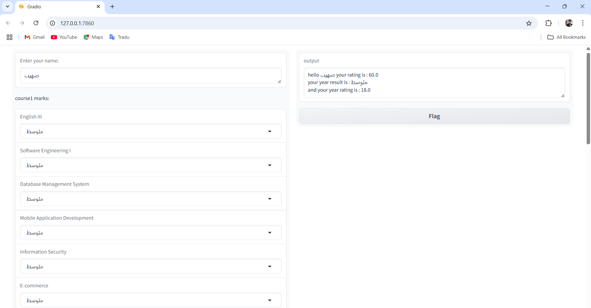
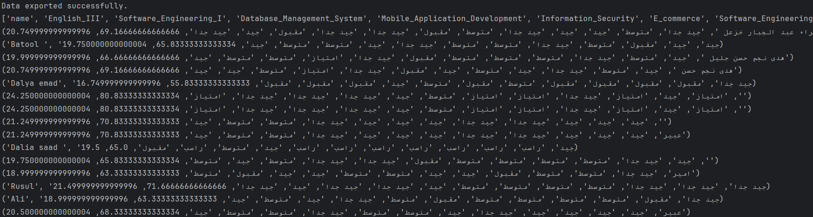

# 🎓 Calculating Marks – Yearly Grade Calculator

This project is a simple system for **entering, calculating, and saving university course grades** using **Python**, **Gradio**, and **SQLite**. It allows users to select their grades for various materials and instantly calculates their **average, year rating, and overall result** — then stores the data locally in a database.

---

## 📸 Demo & Screenshots

  

---



---

## 🧠 Features

- ✅ Interactive **Gradio interface** for grade input
- ✅ Calculates **average grades** and **year rating**
- ✅ Saves all student data to a **local SQLite database**
- ✅ Displays messages in **Arabic** (including encouragement for failed subjects)
- ✅ Supports common Arabic grade levels: `راسب`, `مقبول`, `متوسط`, `جيد`, `جيد جدا`, `امتياز`
- ✅ Dark theme for clean UI
- ✅ View full results using a separate Python script

---

## 🛠️ Technologies Used

- 🐍 Python
- 🖼️ Gradio (for user interface)
- 🗃️ SQLite (for local data storage)

---

## 📁 Project Structure

```bash
.
├── marks.py           # Main Gradio app for entering and saving grades
├── degres_check.py    # Script to print out all saved student records
├── grades.db          # SQLite database file (auto-created on first run)
├── media/
│   ├── form-example.jpg
│   └── result-display.jpg

---
```
## 📁 How to use it

1. Download the two files (`marks.py` and `degres_check.py`) and open them in any Python editor.
2. Run `marks.py` — it will give you two links (local and public). You can share the **public link** with others so they can use the system.
3. Once someone uses the app, a new file named `grades.db` will be created automatically in the same folder as `marks.py`.
4. The `grades.db` file automatically saves all user responses and grades locally.
5. To view all saved data, run `degres_check.py` — make sure it's in the same directory as `grades.db`, or update the file path if needed.
6. You can easily modify the code to match your own subjects or grading system — it's simple and flexible!
7. Enjoy using it 🎉
   
---

Don't forgit to give me a ⭐ on this project if you liked it


